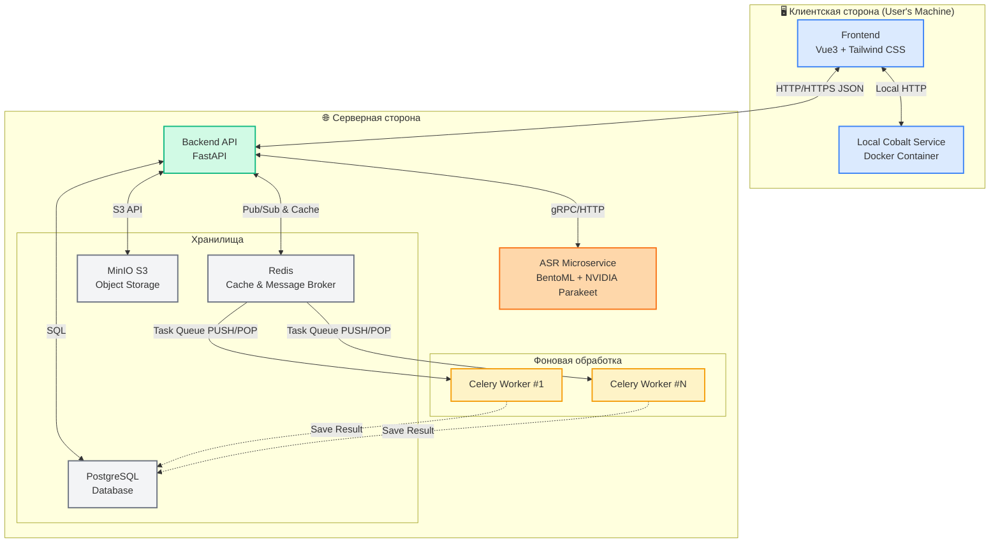
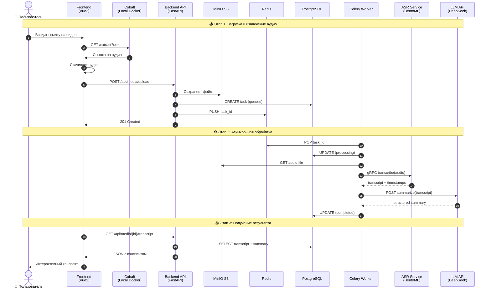

# VideoSummarizer Backend

## Дипломная работа
**Тема:** Разработка веб-приложения для создания интерактивных конспектов на основе медиаданных.

**Идея:** Пользователь загружает медиафайл или ссылку на Rutube. Система извлекает аудио (через Cobalt), сохраняет его в объектное хранилище MinIO, транскрибирует речь через локальный ASR-сервис, а затем с помощью LLM генерирует структурированный конспект с временными метками.

Проект построен на базе архитектуры микросервисов и модульного монолита, взаимодействующих через асинхронные очереди (Celery/Redis) и gRPC/HTTP протоколы. Это обеспечивает масштабируемость тяжелых вычислительных задач (ASR/LLM) отдельно от API-сервера.

## Технологический стек

### Backend
| Технология     | Версия  | Назначение               |
|----------------|---------|--------------------------|
| **Python**     | 3.12+   | Язык программирования    |
| **FastAPI**    | 0.128.0 | Веб-фреймворк (API)      |
| **SQLAlchemy** | 2.0.46  | ORM (асинхронная)        |
| **Pydantic**   | 2.12.5  | Валидация данных         |
| **Celery**     | 5.6.2   | Очереди задач            |
| **Redis**      | 7.2.1   | Брокер сообщений + кэш   |
| **PostgreSQL** | 16      | Реляционная БД           |
| **MinIO**      | latest  | S3-совместимое хранилище |

### Frontend
| Технология       | Версия | Назначение                |
|------------------|--------|---------------------------|
| **Vue.js**       | 3.x    | Реактивный фреймворк      |
| **Tailwind CSS** | 3.x    | Утилитарный CSS-фреймворк |
| **TypeScript**   | 5.x    | Типизация                 |
| **Pinia**        | 2.x    | State management          |

### ML & AI
| Компонент       | Технология               | Описание                               |
|-----------------|--------------------------|----------------------------------------|
| **ASR**         | NVIDIA Parakeet-TDT 0.6B | Локальная модель распознавания речи    |
| **ASR Serving** | BentoML                  | Динамический батчинг, оптимизация GPU  |
| **LLM**         | DeepSeek / GigaChat API  | Суммаризация и структурирование текста |

### Инфраструктура
- **Docker** + **Docker Compose** — контейнеризация
- **Cobalt** (локально) — извлечение ссылок на аудио
- **JWT** — аутентификация (access + refresh токены)
- **WebSocket** — обновление статуса в реальном времени

---

## Архитектура проекта



### Поток данных (Video-to-Transcript)



## Структура проекта (бэкенд)

```
modules/
├── auth/               # Управление пользователями и доступом
├── media/              # Роутеры загрузки, интеграция с S3 (MinIO)
│   ├── storage.py      # Клиент S3Storage
│   ├── tasks.py        # Celery таски для БД
│   └── service.py      # Логика обработки медиаданных
├── asr/                # Взаимодействие с ASR сервисом
│   ├── service.py      # Клиент для BentoML (HTTP/gRPC)
│   └── tasks.py        # Celery задача process_media (нарезка, вызов ASR)
├── llm/                # Генерация конспектов через DeepSeek API
└── shared/             # Общие ресурсы (DB session, Celery app, EventBus)
```

## Реализованные возможности

### Модуль `auth`
- ✅ Регистрация нового пользователя (email, password)
- ✅ Вход (JWT access token в теле ответа, refresh token в HttpOnly cookie)
- ✅ Автоматическое обновление access token по refresh token
- ✅ Выход (отзыв refresh token)
- ✅ Получение информации о текущем пользователе (`/me`)
- ✅ Роли подписки (free, pro, enterprise) – базовая структура
- ✅ Защита эндпоинтов через `CurrentUser` и `require_subscription`

### Модуль `media`
- ✅ Загрузка видео/аудиофайлов (до 500 МБ, поддерживаемые форматы)
- ✅ Сохранение файла на диск с подпапкой по `user_id`
- ✅ Вычисление SHA-256 хеша (для будущей дедупликации)
- ✅ Создание записи в таблице `media` со статусом `uploaded`
- ✅ Создание записи в `processing_jobs` для этапа `asr` (статус `pending`)
- ✅ Эндпоинты: `POST /media/upload`, `GET /media/list`, `GET /media/{id}/status`
- ✅ Интеграция с Celery: после загрузки запускается задача `process_asr`

### Модуль `asr`
- ✅ Загрузка модели `nvidia/parakeet-tdt-0.6b-v3` при старте воркера (кеширование)
- ✅ Извлечение аудио из видео через `librosa` (с поддержкой ffmpeg)
- ✅ Разбиение на технические сегменты (30 сек, перекрытие 2 сек) для обработки длинных файлов
- ✅ Транскрипция с временными метками (параметр `timestamps=True`)
- ✅ Сбор семантических сегментов от модели, дедупликация перекрытий
- ✅ Сохранение результата в таблицу `transcriptions` (JSON-массив сегментов + полный текст)
- ✅ Обновление статуса `media` на `transcribed` и завершение задачи `processing_jobs`

### Инфраструктура
- ✅ Настроен Celery с брокером Redis (воркер запускается с `--pool=solo` на Windows)
- ✅ Общий экземпляр Celery в `shared/celery.py` с автоматическим обнаружением задач
- ✅ Создание схем и таблиц БД при старте приложения (`init_db`)
- ✅ Переменные окружения через `.env` (поддерживаются `DATABASE_URL`, `CELERY_*` и др.)

## Запуск проекта (локальная разработка)
### Требования
- Docker & Docker Compose (для Redis, MinIO, Cobalt)
- Python 3.12+
- FFmpeg

### Установка
1. Клонировать репозиторий.
2. Установить зависимости: `uv sync`.
3. Запустить инфраструктуру: `docker-compose up -d`.
4. Настроить `.env` (параметры БД, S3 и API ключи).

### Запуск компонентов
```bash
# FastAPI сервер
uvicorn main:app --reload

# Celery воркер (обработка задач)
celery -A modules.shared.celery worker --loglevel=info --pool=solo

# ASR сервис
bentoml serve asr_service:latest
```
